# Auto-Merge Future Implementation Contract

This working document preserves the detailed implementation design removed from fullsend PR #7151 on 2026-09-22. The PR is intentionally limited to the architectural decision. Use this document for follow-up design/specification work, especially the two-phase merge-queue protocol required by fullsend-ai/fullsend and fullsend-ai/agents.

Source at preservation time: PR branch `docs/adr-dedicated-auto-merge-boundary`, with uncommitted queue-design revisions based on GitHub's expected-head asynchronous merge API and exact `merge_group` authorization.

---

# Auto-Merge Contract v1

Normative behavior for Fullsend's dedicated Auto-Merge stage. The architectural
decision and rationale are recorded in
[ADR 0110](https://github.com/fullsend-ai/fullsend/blob/main/docs/ADRs/0110-dedicated-auto-merge-authority-boundary.md).

## Status and scope

This specification defines the contract that the first mutation-capable
Auto-Merge implementation must satisfy. It is intentionally more detailed than
the ADR: the ADR decides where merge authority lives; this document defines the
components, inputs, state transitions, refusal behavior, security properties,
and evidence required to exercise that authority.

In this document, **Auto-Merge system** means the complete Fullsend lifecycle:

1. the stage dispatcher and deterministic candidate filter;
2. the sandboxed Auto-Merge agent, which makes a non-authoritative eligibility
   assessment;
3. the trusted host-side authorization gate and forge driver; and
4. the forge's normal branch-protection and ruleset enforcement.

The **Auto-Merge agent** is only item 2. It does not merge pull requests, mint
credentials, override policy, or decide which repository or revision receives
a mutation.

Version 1 is GitHub-first and same-repository only. GitLab support,
cross-repository pull requests, broad source-code cohorts, and model-selected
policy are outside the first mutation-capable release.

### Validation evidence

The authority boundary, binding-tuple verification chain, and fail-closed
behavior have been validated in a private integration lab
([ADR 0110 § Lab validation](https://github.com/fullsend-ai/fullsend/blob/main/docs/ADRs/0110-dedicated-auto-merge-authority-boundary.md#lab-validation)).
The lab exercised the complete path from issue through triage, coding,
review/fix, CI, semantic eligibility evaluation, and exact-head merge, with 66
controller and dispatch unit tests covering stale approvals, pending and failed checks,
hold labels, disallowed paths, missing and oversized patches, unknown
mergeability, stale base, stale merge preview, native auto-merge enabled,
unsigned commits, unresolved threads, changes-requested reviews, tampered
bindings, receipt ordering, duplicate receipts, dispatch selection, and
aggregate mergeability self-deadlock. The lab's key discoveries — pull-request
base and controller-configuration staleness, the need for live-base and
merge-preview parent verification, explicit patch evidence, aggregate
mergeability self-deadlock, and unreliable workflow-token label wake-ups — are
incorporated into this contract.

## Desired outcome

Fullsend should be able to merge a narrowly allowlisted class of pull requests
without a human clicking the merge button, while preserving the same repository
policy, required checks, required reviews, CODEOWNERS rules, and merge
requirements that would govern a human merge. Version 1 supports both a direct
expected-head merge and a GitHub merge queue. The queue path is a two-phase
protocol: expected-head enrollment followed by a required authorization check
on the exact queue-generated merge-group revision.

The feature is successful only when an autonomous merge is:

- **authorized** by current repository policy and trusted human intent;
- **bound** to the exact head revision, base branch, and base state that were
  reviewed;
- **least-privileged**, with no merge-capable credential exposed to the model;
- **fail-closed** when required state is stale, missing, contradictory, or
  unknown;
- **idempotent** across duplicate events and concurrent runs;
- **explainable** through stable reason codes, traces, and a durable merge
  receipt; and
- **reversible operationally** through tested kill switches and cohort rollback.

Reducing clicks is not sufficient if any of these properties is lost.

## Non-goals

Version 1 does not:

- make Review responsible for merging;
- restore or alias `CODE_AUTO_MERGE` or `CODE_AUTO_MERGE_METHOD`;
- allow the Code agent to merge a pull request it created or modified;
- give the Auto-Merge model a GitHub write token or arbitrary mutation tool;
- bypass branch protection, required reviews, required checks, or merge queues;
- infer authorization from a PR title, label, author identity, or model output
  alone;
- auto-merge changes to Fullsend policy, agent definitions, workflows,
  credentials, release infrastructure, or other protected paths;
- replace forge-native or third-party automation such as Renovate's own
  `automerge` setting; those remain separately governed policy surfaces; or
- promise that a merged change is defect-free. Auto-Merge automates a bounded
  authorization decision and must still be measured against post-merge
  outcomes.

## Required invariants

Every implementation and test suite must preserve these invariants.

**One Fullsend-owned path.** The dedicated `auto-merge` stage is the only
Fullsend-owned autonomous-merge path. Code, Review, Fix, Retro, and custom
post-scripts must not provide an alternate environment-variable or side-effect
path to autonomous merge.

**Assessment is not authority.** An agent result can recommend `eligible`; it
cannot grant merge authority. Only the host-side gate may authorize the forge
driver after fresh revalidation.

**Exact-revision binding.** `reviewed_head_sha`, `evaluated_head_sha`,
`final_observed_head_sha`, and `requested_head_sha` must be equal. These are the
schema names for the reviewed, evaluated, freshly observed, and
mutation-supplied heads respectively. At direct merge or queue enrollment, the
base branch and base SHA observed during Review must match the current base; a
retarget or pre-enrollment base update invalidates the assessment. Because
GitHub's direct merge endpoint does not condition on base SHA, the direct path
also requires current forge rules to atomically reject a head that is not up to
date with the base at merge time. Without that strict rule, direct mutation is
unsupported. Any mismatch produces a non-mutating stale result.

For a queue path, expected-head enrollment binds the exact PR head, and a
second assessment binds `queue_base_sha`, `merge_group_head_sha`, the ordered
queue entries and PR heads, queue configuration fingerprint, and current policy.
The queue authorization check is reported only on that exact merge-group SHA.
A rebuilt or reordered group requires a fresh assessment; no approval carries
between merge-group revisions. A base advance after accepted enrollment
invalidates the old group binding, not the exact-head enrollment; the new group
must receive complete second-phase assessment against its new base.

**Current policy wins.** The final gate uses current policy, rulesets, reviews,
checks, holds, cohort membership, and pull-request state. A cached
pre-inference snapshot cannot authorize a mutation.

**Unknown never passes.** Unavailable or indeterminate authoritative state is
represented explicitly as unknown and results in `waiting`, `needs_human`, or
`platform_error`; it is never converted to eligible.

**Normal forge enforcement.** The v1 driver follows the repository-selected
path: an allowed direct method or the required merge queue. It never uses an
administrator bypass or weakens repository protection. Queue enrollment uses
an expected-head conditional request and final authorization is a required
check on the queue-generated revision; Fullsend never bypasses the queue.

**Credential isolation.** The Auto-Merge evaluator sandbox receives no
merge-capable credential. Live mutation uses a short-lived, repository-scoped
installation token for a dedicated identity with the minimum forge permission
required for merge. GitHub currently requires `Contents: write`, which has
residual capability beyond merge and therefore must remain isolated inside a
constrained host broker. The broker exposes only expected-head direct merge,
expected-head asynchronous queue enrollment, typed result lookup,
ownership-checked dequeue, and queue-check publication. It rejects push,
PR-create/metadata, native-auto-merge, policy, and administrator-bypass
operations, and binds every request to the selected repository, pull request,
expected head, and policy snapshot.

**Human veto.** A trusted current hold, changes-requested review, missing
required human approval, or human-required finding vetoes autonomous merge. An
untrusted actor cannot grant authority or remove a trusted veto. Fullsend App
and bot identities do not satisfy a human-approval or CODEOWNERS-human gate by
default. A cohort may explicitly permit structured Review attestation in place
of human approval only when that choice is human-approved, policy-fingerprinted,
and independently enforced by the host.

**At-most-once mutation request.** A run may issue at most one direct-merge or
queue-enrollment request. A repository/PR lease is acquired atomically and carries a unique
monotonic fencing token, bounded expiry/renewal, and ownership-checked release.
The driver verifies the current fence immediately before mutation. The fenced
lease and idempotency key prevent a stalled predecessor or concurrent successor
from issuing duplicate requests for the same head, base, and policy
fingerprint.

**Observe/live parity.** Observe mode executes the same candidate, assessment,
and final authorization logic as live mode. Its only intentional difference is
that it has no write capability and replaces the mutation with a recorded
preview.

**Auditable outcome.** Every terminal decision has stable reason codes. Every
mutation request has a durable pending/outcome receipt pair that identifies the
reviewed head, policy, actors, checks, mechanism, and result without recording
credentials.

**Authenticated authority records.** Review attestations, leases, idempotency
keys, authorization snapshots, and receipts must be persisted in
host-authenticated storage that pull-request participants cannot forge or
replace. Record-specific writer ACLs or signatures enforce separation of
duties: only Review may issue attestations; Auto-Merge can read but cannot forge
them; lease and receipt records are append-only and independently attributable
to the controller run. Comments, labels, check summaries, and other
participant-writable forge surfaces may mirror state for users but are never
authoritative inputs.

**Write-ahead receipt.** An authenticated durable pending authorization receipt
containing the authorization snapshot, request identity, and idempotency key
must be persisted before the forge request is issued. It is not overwritten by
the later result. A distinct outcome receipt references it and records success,
refusal, or ambiguity. If the host crashes after the forge accepts the request
but before the outcome is recorded, startup or asynchronous reconciliation must
append the outcome after inspecting current forge state.

## Architecture and authority boundary

```mermaid
flowchart LR
    E[Forge event] --> D[Stage dispatch]
    D --> F[Deterministic candidate filter]
    F -->|not a candidate| O[Record outcome with reason codes]
    F --> C[Host builds AutoMergeContext]
    C --> A[Sandboxed Auto-Merge agent]
    A --> V[Validate structured assessment]
    V -->|not eligible or invalid| O
    V --> L[Acquire per-PR lease]
    L -->|another run owns lease| O
    L --> G[Host re-fetches authoritative state]
    G -->|gate fails or state unknown| O
    G --> P{Repository path}
    P -->|direct| M[Expected-head direct merge]
    P -->|queue| Q[Expected-head queue enrollment]
    Q --> W[merge_group checks_requested]
    W --> X[Authorize exact cumulative group SHA]
    X -->|required check passes| J[GitHub queue merge]
    M --> R[Receipt and outcome telemetry]
    J --> R
```



### Binding tuple

Every autonomous merge decision applies to exactly one immutable tuple:

```text
(forge_instance, repository_id, pull_request_number, head_sha, base_ref, base_sha, policy_fingerprint)
```

Queue execution adds a second immutable tuple:

```text
(forge_instance, repository_id, queue_entry_id, async_request_uuid,
 pull_request_number, pr_head_sha, queue_base_sha, merge_group_head_sha,
 queue_entries_fingerprint, queue_config_fingerprint, policy_fingerprint)
```

`forge_instance` and the forge's immutable `repository_id` are authority-bearing;
owner/repository names and URLs are display metadata only. The policy
fingerprint is SHA-256 over RFC 8785 canonical JSON of the complete policy
state, prefixed by the domain separator `fullsend:auto-merge-policy:v1\0`.
The policy state includes mode, cohorts, protected paths, allowed methods,
kill-switch state, and every other field that affects authorization. Two policy
loads with identical content produce the same fingerprint regardless of load
time.

Changing any member invalidates the decision. The tuple is established during
deterministic preflight, bound in the model's structured output via the context
fingerprint and explicit head/base fields, and re-verified during authoritative
postflight before any mutation. Every data contract, receipt, and authorization
snapshot must carry the complete tuple, and every revalidation must confirm it
against live forge state.

### Three trust zones

The architecture separates into three trust zones:

1. **Trusted runner pre-script** — reads live forge state, applies deterministic
   policy, assembles bounded secret-free evidence with a canonical integrity
   hash, and rejects ineligible candidates before model invocation.
2. **Credential-free model sandbox** — evaluates semantic questions that
   deterministic checks cannot answer. Receives no merge-capable credential,
   no forge write token, and no network authority to mutate the pull request.
3. **Trusted runner post-script** — persists the write-ahead receipt, re-runs
   every mutable gate against live forge state, and may request only an
   expected-head direct merge or expected-head queue enrollment. The trusted
   queue workflow separately authorizes each exact generated group SHA.

AI intelligence is not the safety-critical property. The host-side scripts are.
The model may tighten the decision but cannot override any deterministic veto.
A compromised or prompt-injected model output cannot cause a merge because the
post-script independently re-verifies every authoritative fact.

### Component responsibilities

#### Stage dispatcher

The dispatcher decides whether an event should cause an Auto-Merge evaluation.
It authenticates and authorizes the triggering actor under Fullsend's existing
dispatch contract, debounces duplicate events, and scopes concurrency by forge,
repository, and pull request. Dispatch is permission to evaluate, not permission
to merge.

#### Deterministic candidate filter

The filter performs cheap, authoritative checks before model inference. It
rejects obviously ineligible pull requests and emits reason codes without
spending model capacity. It must not reinterpret unknown state as a pass.

For the same-repository v1 boundary, the filter must compare immutable forge
repository identifiers: the pull request's head repository, base repository,
and configured repository must all be present and equal, and the head
repository must not be a fork. A mismatch produces
`fork_or_cross_repository`; missing identity is unknown and fails closed.

The filter must fetch the live base-branch SHA directly from the branch, not
trust only the base SHA embedded in the pull-request payload. Lab testing
revealed that GitHub's pull-request payload and synthetic merge preview can
remain based on an older base revision even while the UI describes the PR as
clean. The filter must verify that the merge preview's ordered parent tuple is
exactly `[live_base_sha, head_sha]`. If the merge preview is unavailable or
returns an error, the filter must treat the base-SHA verification as failed
(unknown never passes).

The same live-base lookup and ordered merge-preview parent check must be
repeated during final postflight immediately before mutation. In addition,
current forge rules must prove that the merge operation atomically rejects an
out-of-date head. A per-PR lease prevents duplicate requests for one PR but does
not serialize unrelated merges or human actions that advance the base.

On GitHub, aggregate `UNSTABLE` means structurally mergeable with at least one
non-passing status and can be caused by Auto-Merge's own in-progress check. It
is not sufficient evidence either to pass or fail. The filter must prove every
policy-named required check succeeded on the exact head and may then accept
`CLEAN` or `UNSTABLE`; `BEHIND`, `BLOCKED`, `DIRTY`, `DRAFT`, and `UNKNOWN`
remain non-mutating outcomes.

The Auto-Merge controller's own in-progress check must not be configured as a
required pre-merge check, because that creates a circular dependency. If it is
required by current rules, policy is unsupported and the controller must not
mutate.

The implementation should accumulate all failing conditions into the result
rather than short-circuiting on the first failure. This ensures receipts and
reason codes capture every ineligibility reason, making debugging and auditing
substantially easier.

#### Auto-Merge agent

The agent receives read-only, host-assembled evidence and evaluates semantic
questions that deterministic checks cannot answer reliably. Examples include
whether a dependency-only diff actually matches its claimed cohort, whether
lockfile churn is suspicious, whether issue intent appears only partially
satisfied, and whether discussion contains uncertainty that should be escalated.

The agent must treat pull-request content, comments, commit messages, files, and
tool output as untrusted data. It returns one schema-validated assessment. It
cannot choose a different repository, pull request, head SHA, policy, merge
method, capability, or command.

#### Host-side authorization gate

The gate is the sole Fullsend component allowed to convert an eligible
assessment into a mutation request. It re-fetches all high-value state after the
assessment, validates exact-head and policy continuity, acquires the per-PR
lease, and constructs the constrained driver request.

#### Forge driver

The driver implements a small typed operation set: expected-head direct merge;
expected-head asynchronous queue enrollment; asynchronous-result lookup;
ownership-checked dequeue; and publication of the required authorization check
for an exact merge-group SHA. It validates every argument independently and
uses the dedicated identity through the constrained host broker. It does not
expose residual token capability or arbitrary GitHub API access to the agent.

#### GitHub

GitHub branch protection, rulesets, required checks, required reviews, allowed
merge methods, and merge queue remain the final enforcement boundary. A
Fullsend eligibility result never substitutes for those controls.

## Operating modes

Repository policy selects exactly one mode. Missing, empty, malformed, or
unknown mode, policy, kill-switch, or allowlist data resolves to `disabled`
with no evaluation or mutation. An empty allowlist matches nothing and
wildcards are invalid. Higher-level policy may disable a repository but cannot
enable one that lacks an explicit valid repository opt-in.

- **`disabled`** — no Auto-Merge agent run and no mutation. The system may
  record that a candidate was skipped only if normal platform telemetry does so
  without creating user-visible noise.
- **`observe`** — run the complete evaluation and final gate, record the result
  and hypothetical forge path, but provide no merge-capable credential and make
  no GitHub mutation.
- **`explicit`** — evaluate only after a trusted human explicitly requests
  Auto-Merge for the current binding tuple. The request is a trigger, not an
  override; every normal gate still applies. The trigger is latched to the
  tuple on which it was issued: a new head, base, or policy fingerprint
  requires a fresh human request.
- **`automatic`** — evaluate eligible event transitions automatically for an
  explicitly allowlisted repository and cohort. This mode is prohibited until
  the rollout criteria in this document are met.

A mode change takes effect immediately. The final gate must re-read mode so
switching to `disabled` invalidates an in-flight run before mutation.

## Trigger and lifecycle contract

### Triggering events

An implementation may evaluate after:

- Review completes for the current head;
- a required check changes state;
- the pull request receives new commits or becomes ready for review;
- an authorized human adds or removes a hold or approval signal;
- relevant repository policy changes;
- queue or mergeability state changes; or
- a `merge_group.checks_requested` event creates or rebuilds a queue revision;
- an authorized explicit Auto-Merge command is issued.

Events are hints that state may have changed. The event payload itself is not
authoritative evidence for the final gate. An event that arrives before the
pull request is ready (e.g., a review approval while CI is still running) must
stop cheaply at the deterministic candidate filter without spending model
inference. This makes multiple trigger paths practical: each trigger is a
low-cost wake-up signal, and all readiness logic lives in the single preflight
rather than being duplicated across trigger implementations.

The dispatcher must guarantee eventual reconciliation after tracked readiness
transitions regardless of whether Review or CI completes first. It must not
depend on a label or other event written with a workflow-scoped token recursively
starting another workflow. A trusted App/webhook dispatch, explicit
`workflow_dispatch`/`repository_dispatch`, or bounded periodic reconciler must
provide the wake-up path, and duplicate deliveries still coalesce by pull
request.

### Lifecycle

1. **Normalize and authorize the event.** Resolve forge, repository, pull
   request, actor, and transition through existing Fullsend dispatch controls.
2. **Coalesce work.** Preserve the active run and allow at most one pending
   evaluation per forge/repository/pull-request key, following
   [ADR 0106](https://github.com/fullsend-ai/fullsend/blob/main/docs/ADRs/0106-serialize-agent-runs-and-coalesce-subsequent-events.md).
   A second trigger that arrives while a run is active replaces any prior
   pending evaluation rather than starting a concurrent one; at most one
   pending evaluation survives per key.
3. **Load policy.** Resolve global, installation, repository, cohort, and PR
   controls from the current trusted default/base branch, never solely from the
   event payload's potentially stale base SHA, and record a policy fingerprint
   that includes the effective controller configuration.
4. **Run the candidate filter.** Reject disabled, closed, draft, fork or
   cross-repository, unsupported, protected, held, stale, failed, or
   out-of-cohort candidates deterministically.
5. **Build `AutoMergeContext`.** Fetch and timestamp the current evidence. Each
   gate records its authoritative source and known/unknown state.
6. **Evaluate.** Run the sandboxed agent only when deterministic policy allows
   it and validate the returned schema outside the model.
7. **Acquire lease.** Atomically lock the
   forge-instance/repository-ID/pull-request key, obtain a unique monotonic
   fencing token with bounded expiry/renewal, and re-check idempotency for the
   current head and policy fingerprint.
8. **Revalidate under the lease.** Re-fetch the pull request, head, base
   branch, base SHA, Review attestation, checks, reviews, human-intent signals,
   changed paths, rulesets, merge requirements, mode, and policy. The lease
   remains held through the forge request.
9. **Request the normal forge operation.** Persist an authenticated pending
   receipt, then repeat every mutable gate immediately before the forge call.
   In live modes, issue one expected-head direct merge or one expected-head
   asynchronous queue request selected by current repository policy. In observe
   mode, record the same request as a preview without write credentials.
10. **Authorize a queue revision when applicable.** On
    `merge_group.checks_requested`, resolve the ordered queue entries and
    reconstruct the cumulative merge-commit chain from the event's base SHA to
    its head SHA. Re-run deterministic and semantic authorization against the
    exact cumulative tree, wait for every other required check on that SHA, and
    publish the required Auto-Merge check last. A group rebuild starts a new
    assessment.
11. **Record the result.** Emit stable reason codes, a final authorization
    snapshot, queue lifecycle state when applicable, and a merge receipt. Later
    events may resume a waiting pull request from step 3; they do not reuse stale
    authority.

The durable idempotency key must include forge instance, immutable repository
ID, pull request, head SHA, base branch, base SHA, policy fingerprint, and
requested operation. A transmitted request with an unknown result is reconciled
against current forge state and is never re-sent.

For queue enrollment, the idempotency record also includes the asynchronous
request UUID and queue entry ID. Queue-group authorization is keyed by the
complete second-phase binding tuple and may never reuse a result from another
merge-group SHA.

### State model

The implementation may use additional internal states, but its external state
must map unambiguously to this vocabulary:

- **`disabled`** — policy prohibits evaluation;
- **`filtering`** — deterministic candidate gates are running;
- **`evaluating`** — the sandboxed agent is assessing a valid context;
- **`ineligible`** — a deterministic or semantic veto is terminal until input
  state changes;
- **`waiting`** — authoritative external state such as checks, mergeability, or
  the per-PR lease is not ready;
- **`needs_human`** — a human decision, approval, or remediation is required;
- **`stale`** — the attested head, policy, or evidence no longer matches;
- **`eligible`** — the assessment passed, but final authorization has not yet
  completed;
- **`authorizing`** — the host holds the lease and is revalidating current state;
- **`queued`** — GitHub accepted the expected-head queue request;
- **`queue_evaluating`** — the host is authorizing one exact merge-group SHA;
- **`queue_authorized`** — the required authorization check passed on that exact
  merge-group SHA;
- **`dequeued`** — the owned queue entry was removed after a veto, invalidation,
  or operator action;
- **`observed`** — observe mode completed without requesting a mutation;
- **`merged`** — GitHub reports a completed merge;
- **`no_op`** — the pull request was already merged or closed; and
- **`platform_error`** — the platform could not obtain or persist required
  authoritative state.

Only `authorizing` may issue a direct-merge or queue-enrollment request, and
only the host-side gate may enter `authorizing`. A queue merge additionally
requires `queue_authorized` for its exact merge-group SHA. `eligible` alone is
never a mutation state. Every new PR head, merge-group head, or policy
fingerprint starts a new lifecycle and makes prior authorization
non-authoritative.

## Policy model

### Precedence

Policy is evaluated in the following order. A lower level may be more
restrictive but must never weaken a higher-level veto.

1. global emergency kill switch;
2. installation and repository enablement/mode;
3. supported forge, repository, and base-branch allowlists;
4. approved cohort membership;
5. protected-path and CODEOWNERS policy;
6. trusted PR-level hold and human-intent signals;
7. current Review attestation and required approvals;
8. current required checks and mergeability;
9. forge ruleset, allowed merge method, and queue requirements; and
10. the agent's semantic eligibility assessment.

The model appears last because it may tighten the decision but may not override
any deterministic veto.

### Required controls

The logical repository configuration must define, directly or by inherited
policy:

- schema or policy version;
- mode;
- repository and base-branch allowlist;
- allowed cohorts and their match rules;
- protected path classes;
- trusted human trigger and hold semantics;
- whether the cohort requires human approval or explicitly accepts an
  authenticated structured Review attestation instead;
- required Review attestation freshness;
- allowed merge methods; whether direct or queue execution is required; queue
  merge strategy, required authorization-check name, and supported queue
  configuration bounds;
- kill-switch state; and
- policy owner and approval requirements.

The physical configuration file and administration interface are implementation
decisions, but they must produce a canonical, hashable policy snapshot. Changes
to Auto-Merge policy must themselves be human-reviewed and excluded from the
autonomous cohort.

### Initial cohort constraints

The first live cohort must be an allowlist, not an exclusion list. Its exact
membership requires a separate evidence-backed approval. At minimum, the first
cohort must exclude:

- source code and tests;
- GitHub Actions and other CI workflow definitions;
- CODEOWNERS, repository rules, and branch protection configuration;
- Fullsend agent, harness, prompt, skill, hook, or policy files;
- credential, capability, mint, authorization, or sandbox configuration;
- release, deployment, packaging, and security configuration;
- API or cross-repository interface changes;
- `.gitmodules` URL changes, opaque binaries, and unreviewable generated files;
  and
- changes whose intent, effective diff, or issue closure is ambiguous.

A dependency-bot patch or pin update is a plausible first candidate, but bot
identity and a small diff are selectors only. The changed paths, dependency
class, lockfile behavior, current Review evidence, and repository policy must
all independently pass.

### Human intent and veto provenance

Labels, comments, reviews, and slash commands count only when their actor is
authorized for that action under current repository permissions. The system
must preserve enough event or authorization history to distinguish:

- a trusted human adding a hold;
- an untrusted actor attempting to add or remove a signal;
- a trusted human explicitly re-enabling evaluation; and
- a bot mirroring state without possessing authority to grant it.

Removal of a hold does not grant merge authority unless the remover is
authorized. A fake approval in PR text, a commit message, or model output has no
policy effect.

Fullsend App and bot identities are automation, not humans. Their reviews and
CODEOWNERS entries do not satisfy a human-required gate. If a cohort is approved
to operate without a human approval, policy must say so explicitly and the host
must validate the authenticated Review attestation instead of inferring that
authority from a forge-native bot approval.

## Data contracts

Concrete JSON Schemas should be added under this version directory before the
first implementation is consumed across repository boundaries. The following
semantic fields are required even if internal Go types land first.

### `ReviewAttestation`

Review produces a structured attestation for one exact pull-request head. It
contains:

- schema version, forge instance, immutable repository identifier, repository name,
  pull-request number, and base branch;
- base branch and base SHA observed, and `reviewed_head_sha`;
- Review run identifier, completion timestamp, and freshness/expiry data;
- verdict and open finding counts by severity;
- separate agent-remediable and human-required findings;
- protected-path and required-human-approval results;
- Review harness, runtime, model, and implementation fingerprints; and
- policy/configuration fingerprint used during Review.

Missing, malformed, expired, unverifiable, or wrong-head attestations fail
closed. The authoritative attestation must come from host-authenticated storage
that pull-request participants and the Auto-Merge merge identity cannot write.
It must be signed by or stored under a writer ACL exclusive to Review. Forge
comments, labels, and review prose are presentation only. Auto-Merge must not
parse Review prose to reconstruct these gates.

### `AutoMergeContext`

The host-generated context passed to the evaluator contains:

- forge instance, owner, configured/base/head immutable repository identifiers,
  repository name, fork status, pull-request number, and canonical URL;
- base branch, base SHA, `head_sha`, author, and author trust class;
- changed paths, diff statistics, and candidate cohort with match evidence;
- bounded exact-head patch or blob evidence for every changed file, including
  file status, blob SHA, and content/patch bytes. Policy must define positive
  hard per-file and total byte limits and include them in the policy
  fingerprint. Missing, truncated, wrong-head, or over-limit evidence fails
  closed before model invocation;
- the Review attestation summary and current-head association;
- required checks and proof that each applies to the current head;
- review decision, CODEOWNERS result, approvals, holds, and actor provenance;
- branch rules, allowed merge methods, mergeability, and merge-queue state;
- linked issue, closing-keyword, duplicate, and supersession analysis;
- global, repository, cohort, and PR kill-switch state;
- policy and implementation fingerprints; and
- source and observation timestamp for every authoritative gate.

Unavailable facts are encoded as unknown, not omitted or defaulted to success.
The context must be serializable as a secret-free fixture for replay tests.

The context must include a canonical integrity hash (the *context fingerprint*
referenced elsewhere in this contract). It is SHA-256 over RFC 8785 canonical
JSON of the complete context with the fingerprint field omitted, prefixed by
the domain separator `fullsend:auto-merge-context:v1\0`. The post-script must
recompute and verify this hash against the host-retained copy of the context
before trusting pre-script evidence. This prevents tampering between trust
zones, gives both repositories one byte-level algorithm, and enables the receipt
to reference the exact evidence that was evaluated.

### `QueueAuthorizationContext`

The trusted host constructs a separate context for each
`merge_group.checks_requested` event. It contains:

- forge instance, immutable repository ID, base branch, and queue ruleset;
- event base SHA, exact merge-group head SHA, merge method, and queue
  configuration fingerprint;
- the ordered queue-entry IDs, asynchronous request UUIDs when Fullsend owns the
  enrollment, PR numbers, and exact PR head SHAs;
- proof that each synthetic merge commit has ordered parents
  `[previous_queue_head_or_base_sha, exact_pr_head_sha]`;
- the Fullsend enrollment receipt and current PR authorization evidence for
  every Fullsend-enrolled entry in the group;
- exact-tree changed-path, protected-path, Review, human-intent, kill-switch,
  and policy evidence needed for cumulative semantic evaluation; and
- every required check on the exact group SHA, excluding the Auto-Merge
  authorization check itself.

Its fingerprint uses the same canonicalization algorithm as
`AutoMergeContext`, with domain separator
`fullsend:auto-merge-queue-context:v1\0`. A group containing no
Fullsend-enrolled entry is a deterministic pass-through: the authorization
check succeeds without model inference so human and third-party queue entries
are not made dependent on Fullsend enrollment policy.

### `AutoMergeEligibilityResult`

The agent returns exactly one structured result with:

- schema version;
- decision: `eligible`, `ineligible`, `needs_human`, `waiting`, `stale`, or
  `platform_error`;
- `reviewed_head_sha` (from the Review attestation) and `evaluated_head_sha`
  (the `AutoMergeContext.head_sha` the agent assessed against; the exact-head
  and base binding invariant requires these to be equal);
- base branch and base SHA (from `AutoMergeContext`; the exact-head and base
  binding invariant requires these to match the Review attestation);
- context fingerprint (the canonical integrity hash from the input
  `AutoMergeContext`);
- candidate cohort and risk classification;
- one or more stable reason codes;
- concise human-readable summary;
- explicit uncertainties;
- recommended forge path: `direct`, `queue`, `none`, or `unknown`; and
- evaluator model, runtime, harness, and implementation fingerprints.

The schema rejects unknown decisions, missing SHAs, unknown reason codes, and
extra authority-bearing fields. An `eligible` result must have no explicit
uncertainties, must remain within the cohort risk threshold, and must recommend
the forge path selected by current repository policy: `direct` or `queue`.
`none`, `unknown`, or a path that conflicts with current policy is non-mutating.
In particular,
the result cannot contain a credential, arbitrary command, permission override,
alternate repository, alternate pull request, or replacement head SHA.

An `eligible` result is valid only for the context fingerprint, head SHA, base
branch, and base SHA on which it was produced. It expires when any of these
changes.

### `QueueAuthorizationResult`

The queue evaluator returns a distinct, non-authoritative result for one
`QueueAuthorizationContext`:

- schema version and decision: `authorize`, `reject`, `waiting`, or
  `platform_error`;
- queue-context fingerprint, queue base SHA, and exact merge-group head SHA;
- ordered queue-entries fingerprint, queue-configuration fingerprint, and
  current policy fingerprint;
- stable reason codes, risk classification, uncertainties, and a concise
  summary; and
- evaluator model, runtime, harness, and implementation fingerprints.

The host schema rejects missing or mismatched bindings, unknown fields,
uncertainty on `authorize`, and any command, credential, check conclusion,
dequeue target, or other authority-bearing output. The result can recommend an
authorization outcome but cannot publish the required check or mutate a queue.
Only the trusted queue gate may do so after fresh revalidation.

### `FinalAuthorizationSnapshot`

Immediately before mutation, the host records the evidence it actually used:

- `final_observed_head_sha`, base branch, and base SHA;
- context fingerprint (from the evaluated `AutoMergeContext`);
- current policy fingerprint and mode;
- Review attestation identifier and reviewed head;
- required check, review, CODEOWNERS, and human-intent signal summaries;
- current cohort and protected-path result;
- ruleset, allowed direct method, and merge-requirement decision;
- selected forge path and, for queue enrollment, expected-head request
  parameters and queue configuration fingerprint;
- lease identifier, fencing token, expiry, and idempotency key; and
- authorization timestamp.

This snapshot, not the earlier model context, explains why the driver was
called.

### `MergeReceipt`

Every direct-merge or queue-enrollment request produces an authenticated durable
receipt pair. The
pending authorization receipt is written before mutation and contains:

- forge instance, immutable repository identifier, repository display name,
  pull request, base branch, base SHA, and canonical URL;
- `reviewed_head_sha`, `evaluated_head_sha`, `final_observed_head_sha`, and
  `requested_head_sha`, which must satisfy the exact-head invariant;
- context fingerprint;
- cohort, policy fingerprint, and mode;
- Review run, Auto-Merge run, and driver request identifiers;
- summarized checks, reviews, CODEOWNERS, and human-intent signals;
- forge mechanism, merge method, capability identity, token scope/lifetime,
  broker decision, and residual-permission classification;
- implementation, evaluator, runtime, and harness fingerprints;
- decision, authorization, and request timestamps.

For queue execution the receipt additionally records the asynchronous request
UUID, queue entry ID, expected PR head, enrollment status, and each observed
merge-group binding. Queue-authorization outcomes record the ordered-entry
fingerprint, queue base SHA, exact group SHA, queue-context fingerprint,
required-check result, and any ownership-checked dequeue attempt. These records
are append-only: a rebuilt group appends a new outcome rather than replacing an
older success. Publication of the terminal queue authorization check also uses
a pending/outcome receipt pair so a crash cannot leave an unexplained success.

The distinct outcome receipt references the pending receipt and adds the merge
commit SHA when available, completion timestamp, typed result, stable reason
codes, and retry classification. A pre-mutation abort after the pending receipt
is written also produces an outcome receipt; it never rewrites history to imply
that no authorization attempt occurred.

Receipts must not contain tokens, private keys, raw credentials, or
unnecessarily copied pull-request content. The authoritative receipt and
idempotency key must live in host-authenticated storage; a forge comment or
check summary may link to or mirror it but cannot suppress or authorize a
mutation.

## Decision and reason semantics

Reason codes are stable API and telemetry vocabulary. Human-readable wording
may evolve without changing their meaning.

### Candidate and policy outcomes

- `disabled`, `observe_only`, `not_in_cohort`, `unsupported_forge`,
  `unsupported_base`, `fork_or_cross_repository`, `policy_invalid`, `draft`,
  `closed`, `protected_path`,
  `policy_file_changed`, `risk_too_high`, `partial_issue_closure`,
  `duplicate_work`, and `superseded` do not permit mutation.

### Review and human outcomes

- `review_missing`, `head_not_reviewed`, `stale_head`,
  `review_changes_requested`, `human_required`, `human_hold`, and
  `approval_missing` do not permit mutation. A later authorized event may cause
  a fresh evaluation; the old result is not resumed as authority.

### CI and forge outcomes

- `ci_pending` is a waiting outcome. Every policy-named PR check must succeed on
  the exact PR head before direct merge or queue enrollment. Every
  policy-named queue check must succeed on the exact merge-group head before
  queue authorization.
- `mergeability_unknown` is always a waiting outcome; queue configuration does
  not make unknown state authoritative.
- `merge_conflict` is always a waiting outcome; a merge queue cannot resolve a
  conflict that requires code changes.
- `queue_required` selects the queue path; it never falls back to direct merge.
- `queue_head_changed`, `queue_group_rebuilt`, `queue_group_invalid`,
  `queue_entry_mismatch`, and `queue_config_changed` invalidate that group
  authorization without carrying an earlier success forward.
- `queue_check_pending` waits; `queue_dequeued` records a successful owned-entry
  removal; and `queue_request_conflict` requires reconciliation or operator
  action when GitHub reports an existing request whose bound options differ.
- `already_queued` is an idempotent state and must not produce another enqueue
  request.
- `ci_failed`, `unsupported_merge_policy`, and `permission_denied` are
  non-retryable until external state or configuration changes.
- `transient_platform_error` may be retried with a bounded backoff.
- `platform_state_unknown` exhausts as `waiting` or `platform_error`, never
  `eligible`.
- `already_merged` is an idempotent terminal no-op and records the actor and
  merge result when available.

### Race and concurrency outcomes

- `head_changed` or `policy_changed` invalidates the assessment and releases
  the lease without mutation.
- `concurrent_run` coalesces or waits behind the current lease; it must not issue
  a second request.
- `eligible` means the assessment passed. It does not mean the mutation occurred
  and cannot bypass the final authorization snapshot.

## Final authorization algorithm

The live path must implement the following ordering:

1. parse and schema-validate the agent result;
2. reject any result other than `eligible`; also reject an `eligible` result
   that carries any explicit uncertainty, exceeds the cohort risk threshold,
   or recommends a forge path other than the path required by current rules;
3. atomically acquire the forge-instance/repository-ID/pull-request lease and
   its fencing token;
4. re-fetch the pull request and confirm it is open, not draft, and native
   auto-merge is not enabled;
5. confirm the current head equals the reviewed and evaluated head; fetch the
   live base branch SHA and confirm it matches the Review attestation. For a
   direct path, verify the merge preview has ordered parents
   `[live_base_sha, head_sha]`;
6. re-load policy and confirm mode, cohort, and fingerprint continuity;
7. recompute changed-path and protected-path policy;
8. re-fetch Review, approval, CODEOWNERS, and human-intent signals;
9. resolve mergeability, rulesets, and the required forge path. For direct
   execution, prove current forge rules atomically reject an out-of-date head.
   For queue execution, prove the queue configuration and merge strategy are
   supported and select expected-head asynchronous enrollment;
10. re-fetch every policy-named required check and prove it succeeded on the
    current head;
11. check whether the same head is already queued or merged;
12. create the final authorization snapshot and idempotency key;
13. persist an authenticated durable pending receipt containing the
    authorization snapshot, request identity, fencing token, and idempotency
    key before calling the forge;
14. immediately before the forge call, re-fetch and compare every mutable gate
    from steps 4-10: open/non-draft state, native auto-merge, head SHA, base
    branch/SHA, Review attestation, approval and CODEOWNERS state, human-intent
    signals, required checks, mergeability, rulesets, selected path and method,
    queue configuration when applicable, cohort,
    changed/protected paths, kill switches, mode, policy fingerprint, live-base
    direct-path merge-preview parent tuple and strict up-to-date enforcement
    when applicable, and current lease
    fence. Abort if any value changed, became unknown, or the fence is no longer
    current (the abort appends an outcome receipt, performs an ownership-checked
    lease release, and issues no forge request);
15. have the broker verify the fence again and issue at most one expected-head
    direct-merge or asynchronous queue-enrollment request; and
16. persist a distinct outcome receipt that references the pending receipt,
    then release the lease only if ownership and fence still match.

Steps may be combined into atomic forge operations when available, but none may
be omitted. A changed value causes a safe terminal or waiting outcome; it does
not trigger an in-place policy override.

### Queue revision authorization algorithm

After expected-head enrollment, every queue-generated revision must implement
this ordering:

1. accept only a current `merge_group.checks_requested` event and resolve the
   repository, base branch, exact group SHA, and ordered queue entries from
   authenticated forge state;
2. reconstruct the merge-commit chain and verify each cumulative commit has
   ordered parents `[previous_queue_head_or_base_sha, exact_pr_head_sha]`;
3. load current queue rules, policy, enrollment receipts, and Fullsend-owned
   asynchronous request UUIDs, compute the second-phase binding tuple, and
   atomically acquire an exact-group lease/idempotency record;
4. if authoritative state proves the valid group has no Fullsend-enrolled entry,
   publish a deterministic
   pass-through success for this exact SHA without model inference;
5. otherwise, re-run deterministic gates and produce a schema-validated
   `QueueAuthorizationResult` from semantic assessment of the exact cumulative
   tree, including interactions introduced by later grouped PRs;
6. wait for every other required check on the exact group SHA, excluding the
   Auto-Merge authorization check itself;
7. immediately re-fetch the group, ordered entries, policy, Review evidence,
   approvals, holds, kill switches, queue configuration, and required checks;
8. publish the required Auto-Merge authorization check last and only for the
   exact bound group SHA; and
9. append the outcome receipt. On invalidation, fail the check and attempt to
   remove only a queue entry whose Fullsend enrollment ownership is proven.

A new group SHA always starts at step 1. A prior successful check, even for the
same PR heads in a different order or on a different base, is not reusable.
Duplicate delivery for one binding tuple must coalesce behind the exact-group
lease and may publish at most one terminal authorization result.

## Forge behavior

### Direct merge

Direct merge is allowed only when current repository policy permits the chosen
method and the API operation can be bound to the expected head. If exact-head
conditionality is unavailable or cannot be proven, the driver must refuse the
direct merge path.

### Merge queue

When current rules require a GitHub merge queue, the broker calls the
asynchronous merge endpoint with `merge_action: merge_queue` and the exact
reviewed PR head in `sha`. GitHub cancels execution when that head changes. The
broker records the returned UUID and reconciles it through the typed result
endpoint; it never enables generic native auto-merge or invokes an unbound
`Merge when ready` path.

Enrollment is not final authorization. A trusted workflow triggered by
`merge_group.checks_requested` must publish a required Auto-Merge authorization
check on the exact merge-group SHA. It resolves queue entries from forge APIs,
not from the ref name, and verifies the complete ordered merge-commit chain.
For each Fullsend-enrolled entry, the chain must contain the exact authorized PR
head as the second parent. It then evaluates the actual cumulative tree,
rechecks every mutable veto and policy fingerprint, waits for all other required
checks on that group SHA, and publishes its result last.

The check passes through a valid group proven to contain no Fullsend-enrolled
entry without semantic inference. If enrollment ownership cannot be resolved,
the check waits or fails closed rather than assuming pass-through. If a group
contains a Fullsend-enrolled entry, each
new cumulative group SHA requires a fresh assessment, including when later PRs
are added to the group. A rebuild, reorder, policy change, hold, kill switch, or
unverifiable chain fails closed and attempts an ownership-checked dequeue for
the affected Fullsend entry. Group sizes greater than one are first-class; an
implementation may not assume a one-PR queue.

### Protected default branches

Protected default branches are a normal target, not an escape condition. The
driver integrates with their configured direct or queue policy. An unprotected
branch is not automatically safer and
is excluded from the first autonomous rollout unless an explicit policy and
evidence review approves it.

### Transmission and reconciliation

The driver records one of `prepared`, `transmitting`, `accepted`, `rejected`, or
`ambiguous` for the binding tuple. Read-only collection may retry bounded
transient failures before `transmitting`, followed by complete revalidation.
Once transmission begins, no blind resend is permitted because GitHub does not
accept Fullsend's idempotency key. For queue enrollment, the returned UUID is
the reconciliation handle. If GitHub returns `409`, the broker retrieves the
existing request UUID and compares its expected head, action, and options with
the pending receipt; a mismatch is `queue_request_conflict`, not success. A
timeout or lost response becomes `ambiguous`; the controller only reconciles
current forge state. If reconciliation cannot prove the direct merge or queue
enrollment succeeded or failed, an
outcome receipt records the ambiguity for operator resolution. Policy denials,
permission denials, unknown mergeability, stale heads, and malformed agent
output are never retried as mutations.

## Security and abuse cases

The implementation must include adversarial tests for these cases:

- PR text instructs the agent to ignore policy or merge a different PR;
- a commit message or comment contains a fake human approval;
- a Fullsend bot approval is presented as a human or CODEOWNERS approval when
  the current cohort has not explicitly authorized bot-only Review attestation;
- a participant-writable comment, label, or check summary contains a forged
  Review attestation, receipt, lease, or idempotency key;
- an untrusted actor adds a trigger or removes a trusted hold;
- a PR changes Auto-Merge policy, prompts, harnesses, hooks, workflows,
  CODEOWNERS, rulesets, mint roles, or capability code;
- the head changes after assessment but before the forge call;
- the PR is retargeted (base branch changed) while the head stays the same;
- the pull-request payload reports a stale base SHA while the PR shows as
  mergeable (the live base branch must be verified independently, and the
  merge preview's parent tuple must be `[live_base_sha, head_sha]`);
- a human enables GitHub's native "merge when ready" during or after the
  agent's evaluation (the postflight must detect this and refuse mutation;
  Fullsend must not race with native auto-merge to merge the same PR);
- a human directly merges the PR while the agent is mid-evaluation or between
  postflight and the forge call;
- a kill-switch or mode change arrives between final revalidation and the
  forge call;
- branch rules or policy change while a run is in flight;
- mergeability remains unknown after API retries;
- two triggers fire within seconds for the same PR (e.g., review approval
  then CI completion), and event coalescing must prevent concurrent
  evaluations;
- Review finishes before CI and CI finishes before Review, including when a
  workflow-token label does not emit a recursive workflow event; both orders
  must eventually reconcile;
- an event carries a stale base SHA whose checkout lacks current controller
  policy or agent configuration;
- a same-numbered pull request has a head repository identity that differs from
  the configured/base repository;
- model output contains an arbitrary command, target, method, or override;
- a process attempts to use an expired or wrong-target capability;
- the host crashes after the forge accepts a request but before the outcome
  receipt is written; and
- credentials appear in model context, sandbox environment, logs, artifacts,
  traces, or receipts.

Safe behavior is always no mutation plus a typed, observable reason.

## User-visible behavior

Auto-Merge should make its current state understandable without flooding the
pull request with comments. The canonical state is a check/run summary or
equivalent forge-native surface showing:

- mode and cohort;
- current decision and stable reason codes;
- reviewed and current abbreviated head SHAs;
- whether the run is observing, waiting, merged, or needs a human;
- the specific missing gate when action is needed; and
- a link to the run trace or receipt available to authorized maintainers.

The system must not claim “will merge” before final revalidation. In observe
mode it must say that no mutation was attempted. In explicit mode it must make
clear that a human trigger requested evaluation but did not waive any gate.

## Observability and evaluation

Each lifecycle emits a root trace with child spans for candidate filtering,
context construction, semantic evaluation, policy checks, final revalidation,
lease acquisition, forge request, and receipt creation.

Required aggregate measurements include:

- candidates, eligible assessments, mutation attempts, queue enrollments,
  queue-group authorizations, dequeues, and completed merges;
- decision and reason-code distribution;
- prevented stale-head and policy-change mutations;
- duplicate/coalesced runs;
- unknown-state and platform-error rates;
- human veto and post-assessment information-gain rate;
- decision latency, merge latency, and estimated human time saved;
- cost per candidate and per completed autonomous merge; and
- reverts, corrective pull requests, defects, CI failures on the target branch,
  and post-merge rework within the approved look-back window.

A generic model quality score is not a substitute for these safety and outcome
measures. Cohort expansion requires reviewed post-merge evidence.

## Validation requirements

Before `automatic` mode is available, the implementation must prove:

### Contract and unit coverage

- schema validation rejects missing, stale, unknown, and authority-bearing
  fields;
- queue-result schema validation rejects a wrong group SHA, wrong queue-context
  fingerprint, changed entry/configuration/policy fingerprint, uncertainty on
  `authorize`, and any model-selected check or dequeue operation;
- missing or malformed mode/policy resolves to disabled, empty allowlists match
  nothing, and wildcard allowlists are rejected;
- every policy gate accumulates failures rather than short-circuiting, so
  receipts capture all ineligibility reasons, not just the first;
- policy and context fingerprints use the specified domain-separated SHA-256
  over RFC 8785 canonical JSON and match cross-implementation fixtures;
- bounded exact-head patch/blob evidence is complete and rejects missing,
  truncated, wrong-revision, per-file oversized, and aggregate oversized input;
- every policy veto maps to a stable reason code;
- current-head equality, current-base equality, and policy-fingerprint equality
  are mandatory;
- observe and live paths share authorization logic;
- staged execution has no access to a write-capable credential;
- live mutation uses a dedicated identity and short-lived repository-scoped
  installation token isolated behind a constrained broker; the broker exposes
  only expected-head direct merge, expected-head queue enrollment, typed result
  lookup, owned-entry dequeue, and exact-SHA authorization-check publication,
  and rejects push, PR-create or metadata-write, native-auto-merge,
  policy-mutation, and administrator-bypass operations;
- attestations, leases, idempotency keys, and receipts use host-authenticated
  storage with record-specific writer authorization: only Review writes
  attestations, Auto-Merge cannot forge them, and leases/receipts are
  append-only and independently attributable; participant-writable mirrors are
  never authoritative;
- leases use atomic acquisition, unique monotonic fencing tokens, bounded
  renewal, ownership-checked release, and a final driver fence check;
- pending and outcome receipt construction is complete, secret-safe, and
  preserves their ordering and distinct identities;
- write-ahead pending receipt is persisted before the forge request and
  a distinct outcome receipt is appended on success, abort, or crash
  reconciliation; and
- already-queued, already-merged, duplicate-event, and concurrent-run behavior
  is idempotent;
- duplicate `merge_group` delivery coalesces on the complete group binding and
  publishes at most one terminal authorization result;
- once mutation transmission begins, timeouts become `ambiguous` and cannot
  cause an automatic resend; and
- an eligible result with any uncertainty, excessive risk, or a forge path that
  differs from current repository policy is rejected.

### Lifecycle playback

- Review requests changes, Fix updates the head, Review approves the new head,
  checks pass, and the direct expected-head merge completes;
- Review and PR checks pass, expected-head queue enrollment is accepted, the
  exact merge-group revision passes all other required checks, the required
  Auto-Merge authorization check is published last, and the queue merge
  completes;
- a new commit after Review prevents mutation;
- a trusted hold or changes-requested review arriving after assessment prevents
  mutation;
- disabling Auto-Merge during a run prevents mutation;
- closing or manually merging during a run produces a safe no-op;
- retargeting the PR (changing base branch) after Review invalidates the
  attestation and requires fresh Review;
- the base branch advances while the PR head stays the same, producing a stale
  base SHA in the pull-request payload that the live-base verification catches;
- a kill-switch or mode change arriving between final revalidation and forge
  request prevents mutation;
- a host crash after the forge accepts a request leaves a pending receipt and
  startup reconciliation appends the missing outcome receipt;
- duplicate delivery results in at most one forge request;
- an expired predecessor cannot mutate after a successor acquires a newer
  fencing token;
- an unrelated base-branch merge between postflight and mutation is rejected by
  strict forge-side up-to-date enforcement;
- a lost mutation response is reconciled read-only and never retransmitted;
- a lost queue-enrollment response is reconciled by asynchronous request UUID,
  and a `409` with different bound options becomes `queue_request_conflict`;
- changing the PR head after queue enrollment cancels or invalidates that
  request and never authorizes the replacement head;
- group rebuild, reorder, base advance, or added later entries produce a new
  merge-group SHA and a fresh cumulative assessment;
- a trusted hold, policy change, mode disable, or kill switch after enrollment
  fails the exact group check and attempts owned-entry dequeue;
- an unavailable enrollment store cannot be mistaken for proof that a group has
  no Fullsend-enrolled entries;
- Review-first/CI-second and CI-first/Review-second both eventually reconcile;
  and
- stale event-base configuration cannot replace current trusted controller
  configuration.

### GitHub integration coverage

- required checks passing, failing, pending, and associated with an older head;
- required review and CODEOWNERS approval missing or stale;
- bot-only approval when human approval is required;
- mergeability unknown, aggregate `UNSTABLE` caused by the controller's own
  pending check, and merge conflict;
- squash-only, merge-only, rebase-only, and unsupported merge policies;
- protected default branch with direct merge allowed and with a required queue;
- direct merge with expected-head conditionality;
- asynchronous queue enrollment with `merge_action: merge_queue` and the exact
  PR `sha`, including typed result reconciliation by UUID;
- queue groups of size one and the dogfood maximum of five, with ordered parent
  chain verification for every synthetic merge commit;
- mixed human, third-party, and Fullsend-enrolled entries; groups with no
  Fullsend enrollment pass through, while any Fullsend enrollment causes the
  actual cumulative tree to be assessed;
- a rebuilt or reordered group, a stale success on an older group SHA, an entry
  whose exact PR head is absent from the parent chain, and a queue configuration
  fingerprint change all fail closed;
- the Auto-Merge authorization check excludes itself while waiting for all
  other required checks, then publishes last without deadlocking;
- live base-branch verification catches a stale base SHA in the pull-request
  payload, and merge-preview parent verification catches stale synthetic merges;
- strict up-to-date branch protection is required for direct merge, and the
  live-base plus merge-preview-parent checks are repeated during direct final
  postflight;
- immutable repository ID and forge-instance binding reject repository-name
  reuse or rename confusion;
- ruleset, policy, base, and head changes during evaluation;
- protected-path changes and unauthorized signal manipulation; and
- bounded retries for transient read-only GitHub failures before transmission.

## Rollout and rollback

Rollout proceeds in this order. This contract document and ADR 0110 are
normative specifications and may land before step 1.

1. merge the removal of the legacy `CODE_AUTO_MERGE*` implementation;
2. land contracts, schemas, fixtures, and host-side refusal tests;
3. deploy `disabled` mode and verify no alternate mutation path exists;
4. run `observe` mode with complete reason codes and no write capability;
5. compare observed decisions with human outcomes and resolve false eligibility,
   unknown-state, and race findings;
6. enable `explicit` mode for trusted maintainers in one approved repository;
7. dogfood `automatic` mode in `fullsend-ai/fullsend` and
   `fullsend-ai/agents`, using their required grouped merge queues, for one
   narrow approved cohort; verify both queue group size one and mixed groups
   before expansion; and
8. expand only after a dated review of post-merge outcomes and explicit policy
   approval.

Operators must be able to disable one pull request, cohort, repository,
installation, or the entire feature. A global or repository disable must block
in-flight mutation at the final gate. Incident response must be able to locate
all receipts for a policy/cohort version, identify affected merges, pause the
cohort, and follow normal repository governance for any revert.

## Repository ownership

The implementation spans two repositories but has one authority contract.

### `fullsend-ai/fullsend`

Owns stage registration and dispatch, policy loading, candidate filtering,
`AutoMergeContext` construction, schema validation, final revalidation, lease
and idempotency behavior, forge abstraction, expected-head queue enrollment,
merge-group authorization-check orchestration, constrained mutation, receipts,
telemetry, rollout controls, and end-to-end tests.

### `fullsend-ai/agents`

Owns the dedicated Auto-Merge agent identity, harness, prompt, read-only tool
surface, structured result production, evaluator tests, and removal of the
legacy Code post-script behavior. The removal is tracked in
[agents#1219](https://github.com/fullsend-ai/agents/pull/1219).

Neither repository may independently introduce another autonomous-merge
enablement path. Contract changes that affect both implementations require a
version-compatible change here or a new major version.

## Implementation decisions intentionally left open

These choices do not change the v1 safety contract and can be resolved in
focused implementation PRs:

- the concrete repository-policy file and administration interface;
- the model/runtime selected for semantic evaluation;
- the first approved cohort within the two dogfood repositories;
- the length and thresholds of the post-merge evidence window; and
- the author trust class taxonomy and how it is determined.

An implementation choice that weakens any required invariant is not an open
detail; it requires a new architectural decision and contract revision.

## Reviewer checklist

A reviewer should be able to answer **yes** to all of the following before the
first mutation-capable release:

- Is there exactly one Fullsend-owned autonomous-merge path?
- Can the evaluator run with no merge-capable credential?
- Does live mutation use a dedicated identity with a short-lived
  repository-scoped token isolated behind a constrained broker that exposes no
  code-push, PR-create, policy-write, or admin-bypass path, while explicitly
  accounting for GitHub's residual `Contents: write` capability?
- Can a model output ever directly select or invoke a mutation? It must not.
- Is every direct merge or queue-enrollment request bound to the reviewed
  current PR head, base branch, and policy snapshot?
- Does every queue merge require a fresh authorization check on the exact
  cumulative merge-group SHA, with ordered-entry and queue-configuration
  fingerprints and verified merge-commit parentage?
- Does the final gate re-fetch policy, human-intent signals, reviews, checks, paths,
  rulesets, mode, mergeability, head, and base branch/SHA?
- Does unknown state fail closed?
- Can branch protection or queue requirements ever be bypassed? They must not;
  a required queue must select the queue path, never direct merge.
- Do duplicate events and concurrent runs permit at most one request?
- Does a fenced lease prevent an expired predecessor from mutating, and does
  strict forge-side up-to-date enforcement close the direct-path base race?
- Do queue rebuilds, reorders, and cumulative group changes invalidate prior
  group authorization, while groups without Fullsend enrollment pass through?
- Does observe mode exercise the live decision path without write capability?
- Are reason codes and receipts sufficient to explain every outcome?
- Are attestations, leases, idempotency keys, and receipts authoritative only
  from host-authenticated storage with record-specific writer separation?
- Are binding identities immutable and are policy/context fingerprints
  canonical, domain-separated, and independently reproducible?
- Can any timeout after transmission cause an automatic resend? It must not.
- Do both Review/CI completion orders eventually reconcile without relying on
  workflow-token event recursion?
- Are protected paths and Auto-Merge's own control files excluded?
- Are kill switches checked after evaluation and immediately before mutation?
- Has the selected cohort passed staged/live, race, adversarial, and post-merge
  evidence gates?

## Versioning

Breaking changes require `docs/normative/auto-merge/v2/`. Examples include
weakening an invariant, removing a required gate or receipt field, changing the
meaning of a decision/reason code, allowing a new authority source, exposing a
new mutation surface, or expanding beyond same-repository GitHub behavior
without compatible safeguards.

Non-breaking additions within v1 may add optional evidence fields, new
fail-closed reason codes, stricter cohorts, additional protected paths, or
additional tests that preserve all existing safety properties.
